# 🚀 Code Warriors

**Code Warriors** is an interactive web platform designed for developers to share knowledge, ask questions, and solve challenges together.  

This project was completed during a **20-day competition** with a great team.

---

## 🛠 Technologies Used
- **Front-End:** Angular, TypeScript, Bootstrap  
- **Back-End:** Spring Boot (Java)  
- **Database:** MySQL  

---

## 🏆 Competition Experience
- Completed in **20 days** → managing time under pressure  
- Learned **teamwork**, **task synchronization**, and **rapid bug fixing**  
- Presented to a professional jury  

---

## 📹 Video Demo
Watch the platform in action:  

> Click the image to view the demo video on Vimeo.

---

## 🎓 Certificates
Here are some certificates received during the competition or relevant courses:  

  
  

---

## 📸 Competition Highlights
Some photos from the 20-day competition experience:  

  
  

---

## 📸 Screenshots

### Public / User Pages
- **Home Page**  

- **Sign In Page**  

- **Sign Up Page**  

- **Forgot Password Page**  
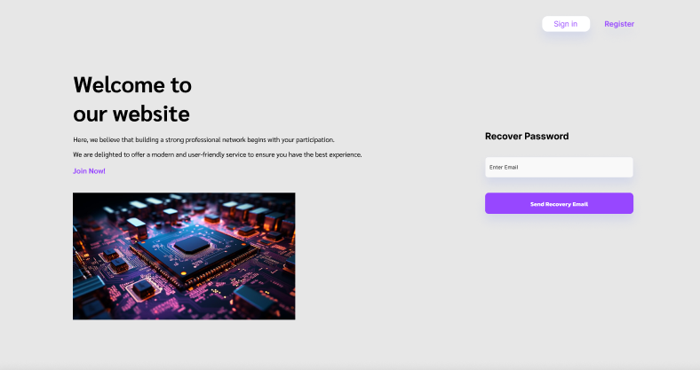  

- **Reset Password Page**  
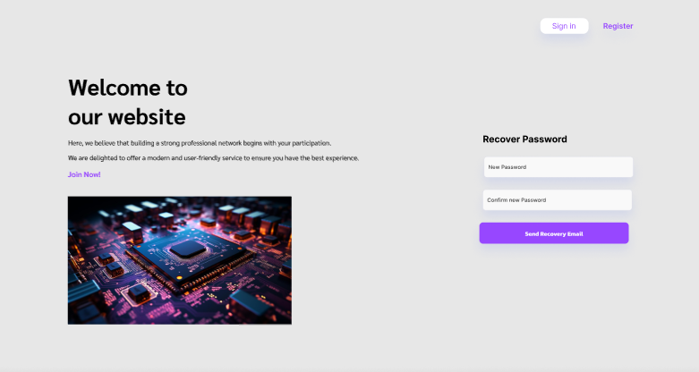

- **User Profile Page**  
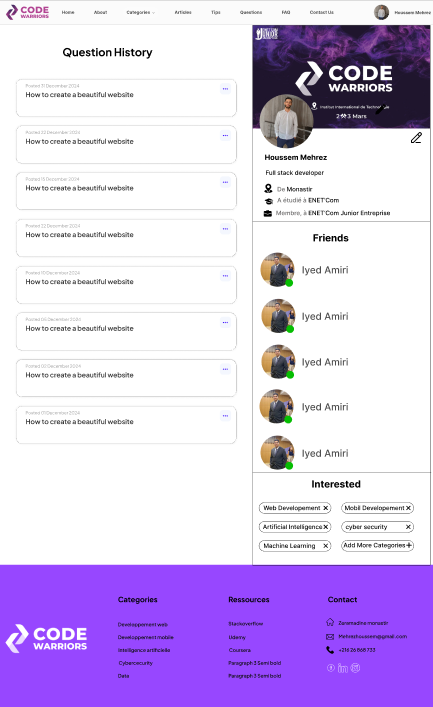  

- **Manage User Profile**  
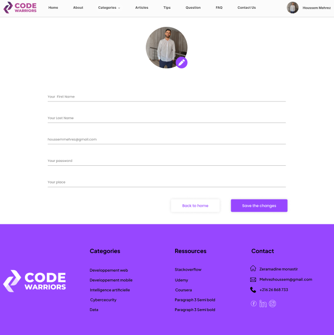

### Questions & Articles
- **All Questions Page**  
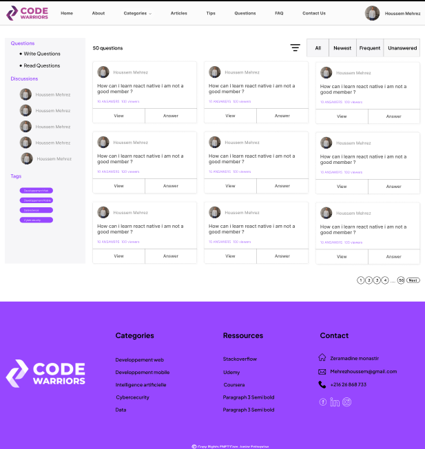

- **Single Question Page**  
(view question + multiple answers + add answer)  
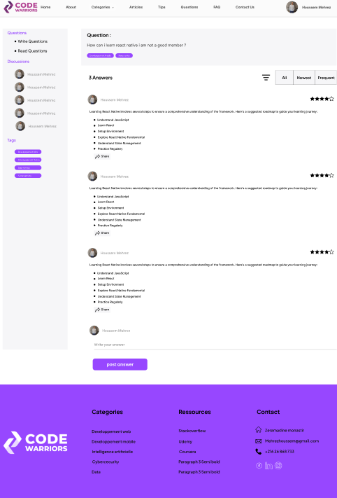

- **Categories Page**  
(example: Web Development)  
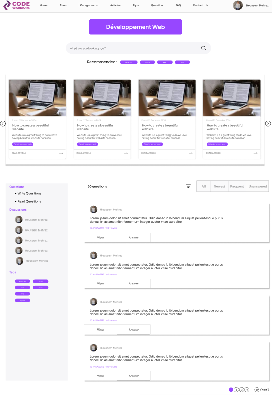

- **Articles List Page**  
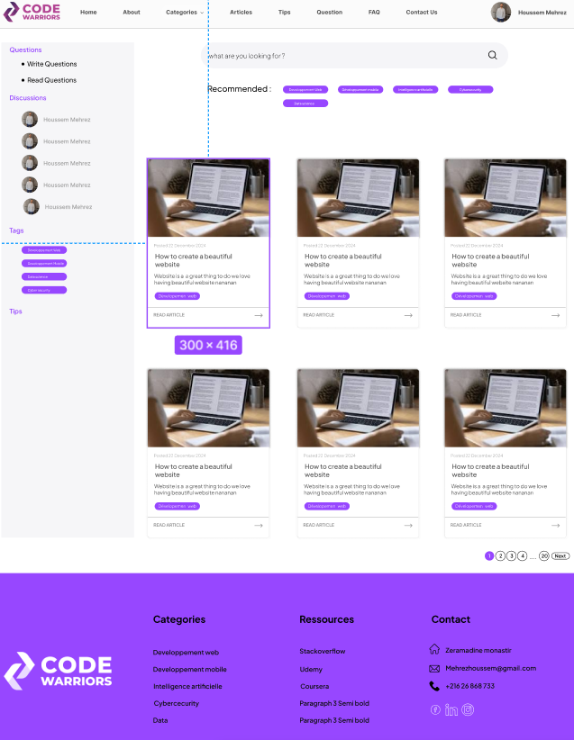

- **About Page**  
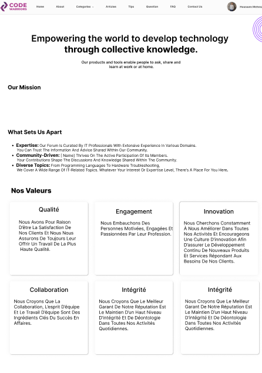

- **Contact Page**  

- **Policy Page**  
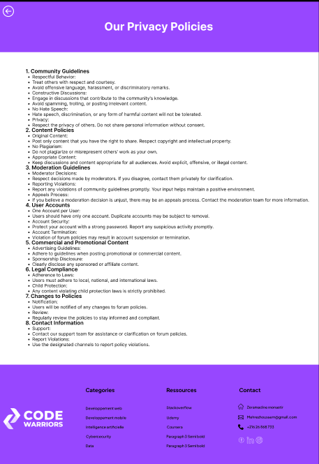

---

## 🛠 Admin Dashboard

- **Website Management**  
Admin can manage the **About page, FAQ, and Privacy Policy**.  
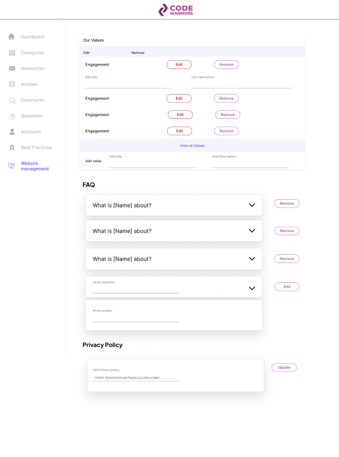

- **Best Practices**  
Admin can create and update best practice guides or tips to inform users.  
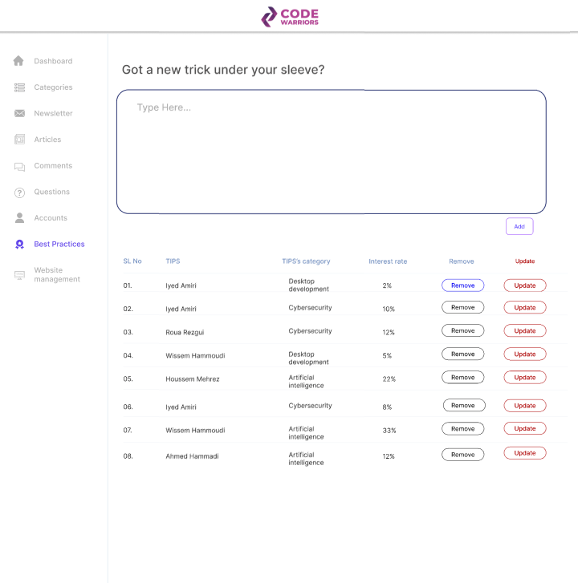

- **Accounts Management**  
Admin can view all registered users and delete accounts if necessary.  
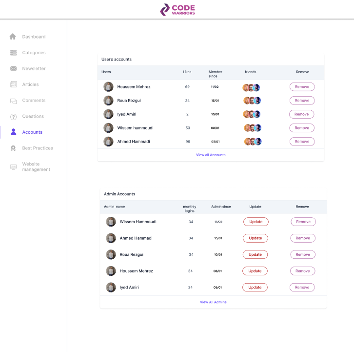

- **Articles Management**  
Admin can add, edit, or delete articles shared on the platform to keep content relevant and up to date.  
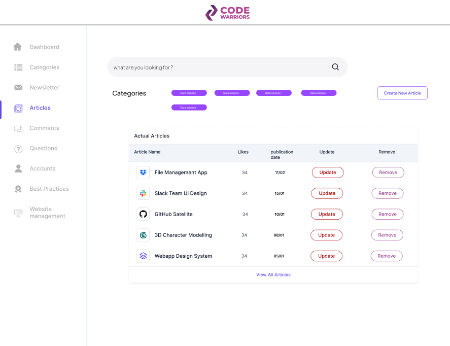

- **Newsletter Management**  
Admin can create and send newsletters to inform users about the latest updates on the platform. Users receive an email notification when new information is added.  
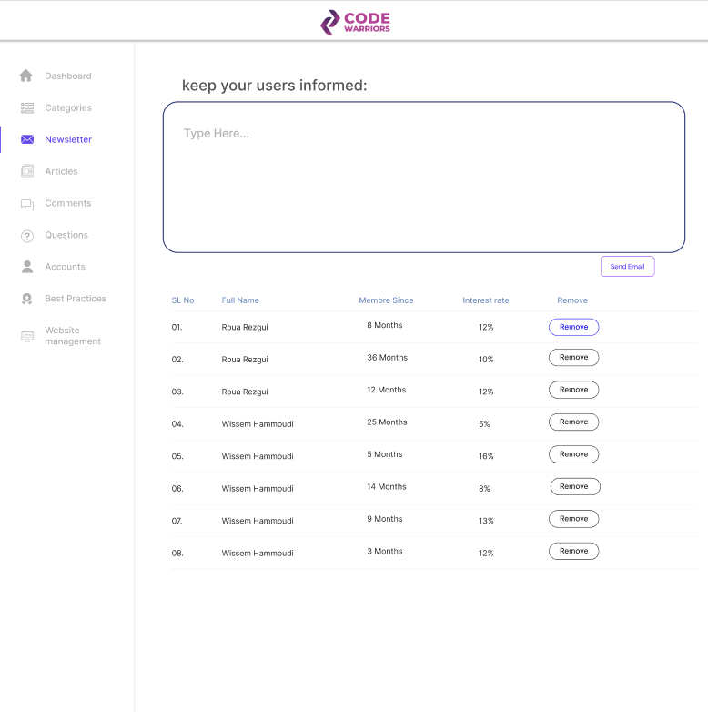

- **Questions Management**  
Admin can view all questions submitted by users and delete inappropriate or unwanted questions manually.  
An automatic filtering system removes questions containing specific prohibited words.  

---

## 🔗 GitHub Link
[View the project on GitHub](https://github.com/YOUR_USERNAME/code-warriors)
